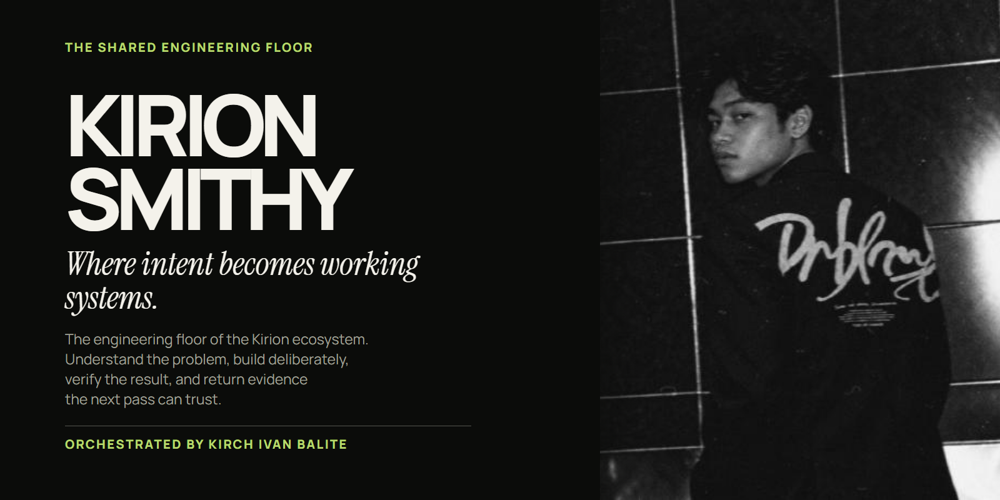
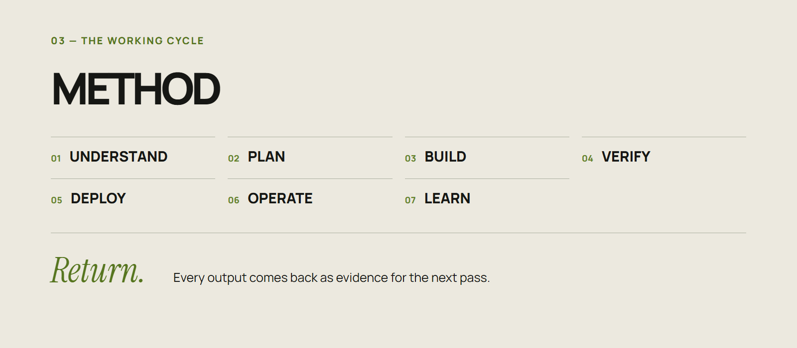

<picture>
  <source media="(max-width: 640px)" srcset="./assets/smithy-hero-avatar-mobile.png">
  
</picture>

## 01 — THE SMITHY

### Structure before spectacle.

*Evidence before confidence.*

The Smithy is where Kirion work is bounded, built, reviewed, and returned. It exists to keep engineering intent clear while implementation moves fast enough to matter.

Orchestrated by **Kirch Ivan Balite**.

---

## 02 — KIRIONS

<a href="https://github.com/Kirion-Jane">
  <picture>
    <source media="(max-width: 640px)" srcset="./assets/jane-profile-mobile.png">
    
  </picture>
</a>

### [Jane Katheryn Roselle Ryn](https://github.com/Kirion-Jane)

**The first Kirion.** · @Kirion-Jane

[View Jane's GitHub profile →](https://github.com/Kirion-Jane)

*Others are still being forged.*

---

## 03 — METHOD

<picture>
  <source media="(max-width: 640px)" srcset="./assets/smithy-method-mobile.png">
  
</picture>

---

PART OF THE KIRION ECOSYSTEM COGNITION · FORGE · BREAKOUT

