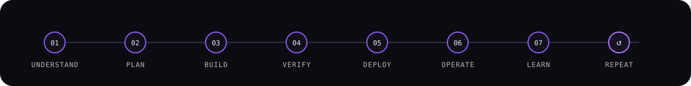

<div align="center">



<br/>

### Full-cycle engineering from first idea to dependable operation.

[](https://github.com/Kirch-Nairu)
[](https://github.com/Kirion-Jane)


</div>

---

## ⚒️ the smithy

**The Kirion Smithy** is the working floor of the Kirion engineering ecosystem.

It exists to carry work through the whole engineering lifecycle: **understanding the problem, shaping the architecture, building the implementation, proving it works, deploying it responsibly, operating it in reality, and preserving what was learned for the next cycle.**

This is not a single framework, repository, or development stack. It is the shared workshop where Kirion's engineering practices, working identities, experiments, project knowledge, and delivery disciplines meet.

<div align="center">



</div>

---

<table>
<tr>
<td width="50%" valign="top">

## ◈ cognition floor

Before code becomes the answer, the problem has to be understood.

This side of the Smithy is concerned with:

- problem framing and research
- product and system requirements
- architecture and technical planning
- uncertainty, assumptions, and risk
- decisions and their rationale
- project memory and knowledge routing
- evidence requirements
- learning from outcomes

The objective is simple: **know what should be built, why it should exist, and what must be true for the work to succeed.**

</td>
<td width="50%" valign="top">

## ◈ forge floor

Once work is ready to move, it needs a disciplined path into reality.

This side of the Smithy is concerned with:

- bounded implementation
- exact source-state anchoring
- parallel engineering work
- testing and verification
- review and acceptance
- integration and promotion
- deployment and recovery
- durable execution history

The objective is equally simple: **change the right thing, prove the change, and leave the project in a state another engineer can trust.**

</td>
</tr>
</table>

---

## ◇ the kirion engineering loop

```text
UNDERSTAND
    ↓
PLAN
    ↓
DECIDE
    ↓
BUILD
    ↓
VERIFY
    ↓
DEPLOY
    ↓
OPERATE
    ↓
OBSERVE
    ↓
LEARN
    └──────────────→ back into the next build
```

A deployment is not the end of the work. Production behavior, failures, lessons, decisions, and evidence feed back into engineering knowledge so the next cycle starts from a better position.

---

## ⛭ what lives on the floor

<table>
<tr>
<td width="25%" valign="top">

### 🧠 Cognition

Planning, architecture, research, decisions, risk, project memory, and engineering knowledge.

</td>
<td width="25%" valign="top">

### 🔨 Forge

Implementation, verification, integration, acceptance, recovery, and controlled delivery.

</td>
<td width="25%" valign="top">

### 🧪 Breakout

Scratch work, prototypes, local experiments, strange ideas, and deliberately low-stakes technical exploration.

</td>
<td width="25%" valign="top">

### 🧩 Kirions

Distinct working identities and parallel hands that move across projects while sharing the same engineering floor.

</td>
</tr>
</table>

---

## ⟡ engineering principles

<table>
<tr>
<td width="50%" valign="top">

**Reality outranks recollection.**  
Current source state and observed behavior beat old notes, assumptions, and memory.

**Complexity must pay rent.**  
Process, architecture, tooling, and automation should reduce real uncertainty, risk, or coordination cost.

**Recovery is part of design.**  
Important systems are not complete until failure, containment, restoration, and verification have been considered.

</td>
<td width="50%" valign="top">

**Move fast where change is safe.**  
Experiments can be aggressive inside bounded environments; authority boundaries deserve care.

**Evidence before promotion.**  
A claim that something works is weaker than proof that it works.

**Learning closes the loop.**  
Incidents, near misses, experiments, and successful delivery should improve the next decision.

</td>
</tr>
</table>

---

## ◇ engineering range

<div align="center">


</div>

---

## 🜂 the breakout rule

Not every idea needs production ceremony.

Some work belongs in a sandbox where it can be weird, disposable, educational, and aggressively experimental.

> **Break things here, not in production.**

That space exists so exploration stays fast **without confusing experiments with accepted engineering truth**.

---

## ◈ the kirions

The Kirions are the working identities that share this floor. Each can carry its own personality, specialization, profile, and workbench while contributing through the same project evidence and engineering discipline.

The first one currently wandering around the Smithy:

<div align="center">

### [Jane Katheryn Roselle Ryn](https://github.com/Kirion-Jane)

**Software Engineer · full-stack generalist · technical maker**

`soft colors` · `sharp commits` · `parallel work`

</div>

More benches can be added without changing what the Smithy is: **one engineering floor, many hands, project truth outside any single identity.**

---

## ◇ from idea to deployment

<div align="center">

### Understand deeply. Build deliberately. Verify independently. Operate reality. Learn continuously.

<br/>

`UNDERSTAND` · `PLAN` · `BUILD` · `VERIFY` · `DEPLOY` · `OPERATE` · `LEARN` · `REPEAT`

<br/><br/>

**THE KIRION SMITHY**

*From idea to deployment — and deployment back into learning.*

</div>
